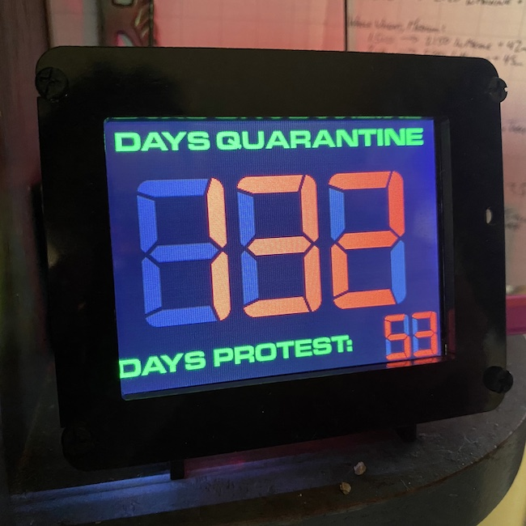

# Quarantine Counter

<table><tr><td></td><td></td></tr></table>

## Essentials

Quarantine Counter is a basic little program that runs on the [PyPortal](https://www.adafruit.com/product/4116) that counts the number of days you've been in quarantine.

It is Copyright 2020 [Brian Enigma](http://netninja.com), and provided under a [Creative Commons Attribution-NonCommercial-ShareAlike 4.0 International license](http://creativecommons.org/licenses/by-nc-sa/4.0/). Tweak it, change it, share it, just please don't sell it.

## Background

As part of [AdaBox 011](https://learn.adafruit.com/adabox011), I got a PyPortal IoT display. I've used it for a few simple projects here and there, but nothing fantastic. This project is also not particularly fantastic, but I thought interesting enough to share. The code is based on the [Event Count-Up Clock](https://learn.adafruit.com/pyportal-event-count-up-clock/overview) sample app, with some minor code and major graphic tweaks.

Feel free to take the code, plug in your own WiFi and Adafruit IO information, and make your own quarantine clock.

## Dual Counters

Perhaps not everyone needs two counters, but in my particular situation, we started informally quarantining, but a few days in I had an appointment with my hair stylist to refresh my purple dye. For various reasons, I decided to stick with that appointment. So technically, that broke quarantine, hence the smaller number in the corner.

## Assets

I crafted the original assets in [Pixelmator](http://www.pixelmator.com/mac/), with a modification to the the Digital-7 typeface, to emulate the skeuomorphism of 7-segment LED displays.

## Code

The code pings the Adafruit IO cloud service to get the current date, then does some simple math in Python to determine the number of days elapsed.